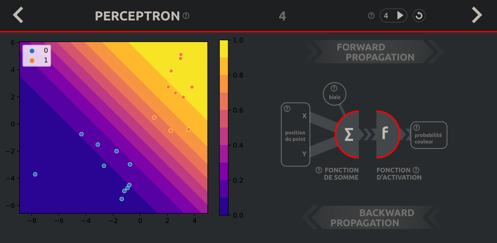
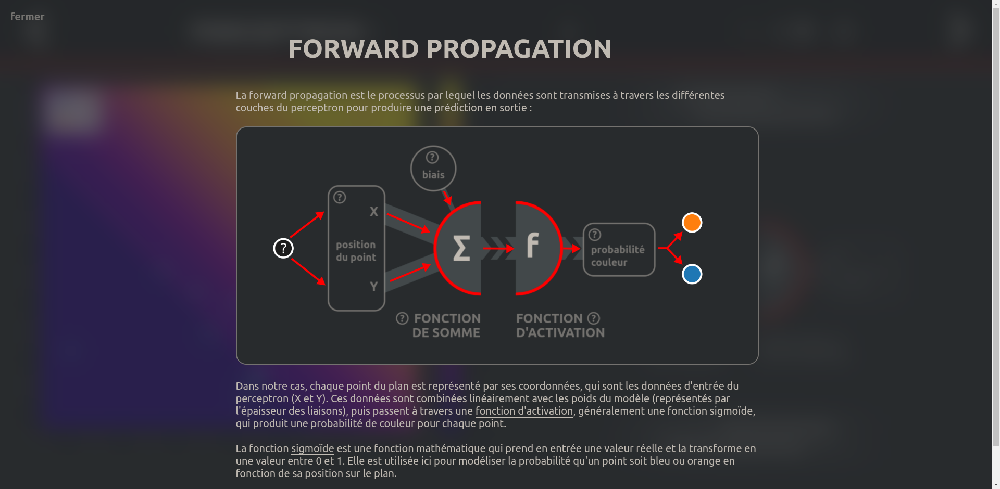
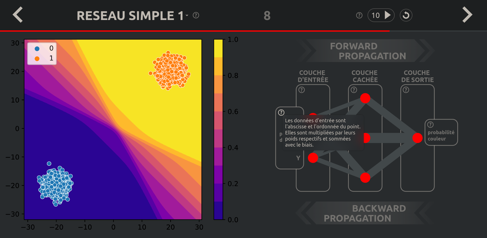
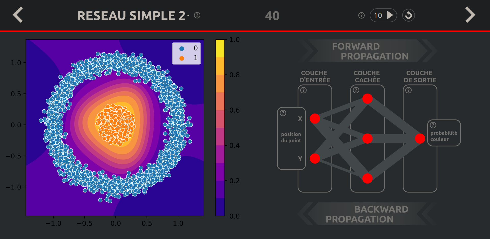
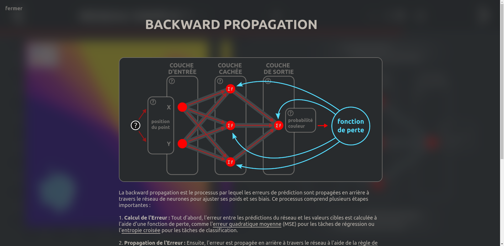
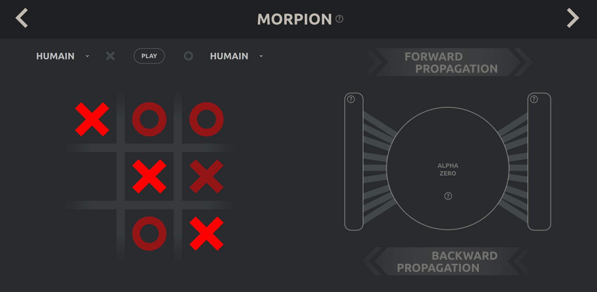

# NeuroDidacte

<table>
  <tr>
    <td></td>
    <td></td>
  </tr>
  <tr>
    <td></td>
    <td></td>
  </tr>
  <tr>
    <td></td>
    <td></td>
  </tr>

</table>

## Name

NeuroDidacte

## Description

NeuroDidacte is a project aimed at providing a simple and accessible explanation of how neural networks work, with a focus on
educational aspects. This project includes the implementation of three types of neural networks: a perceptron, a simple neural
network for classification, and a more complex neural network for playing tic-tac-toe. The goal is to make learning about neural
networks easy and accessible to everyone by providing detailed explanations and concrete examples to facilitate understanding.

## Installation

NeuroDidacte can be installed by cloning the repository from GitHub and following the instructions in the README file. Then,
refer to the "requirements.txt" file for a list of dependencies. Ensure that all dependencies are installed before running the
project.

## Support

For help or assistance, please open an issue on the GitHub repository.

## Roadmap

Future updates for NeuroDidacte may include:

Improvements to the tic-tac-toe neural network
Addition of new neural network structures, such as image processing networks

## Contributing

Contributions to NeuroDidacte are welcome. Please ensure that all contributions follow the project's coding standards and
guidelines. For more information, refer to the CONTRIBUTING.md file in the repository.

## Authors and Acknowledgment

NeuroDidacte is developed by Méziane Gostiaux and Alexys Canet.

## License

This project is licensed under the GNU GPL License.

## Project Status

Development of NeuroDidacte is ongoing. However, progress may slow down temporarily due to other commitments. Contributions and
feedback from the community are appreciated.

## Running the Project

To launch the NeuroDidacte project, navigate to the project directory in your terminal or command prompt. Then, run the following
command to start the Flask server:
python app.py     (windows)
python3 app.py    (linux)
If the command above does not work, you can alternatively open the app.py file in a code editor and execute it directly from
there.
Make sure you have installed all the dependencies and are connected to the internet before accessing the project. For a better experience, it is recommended to install the Ubuntu font.
